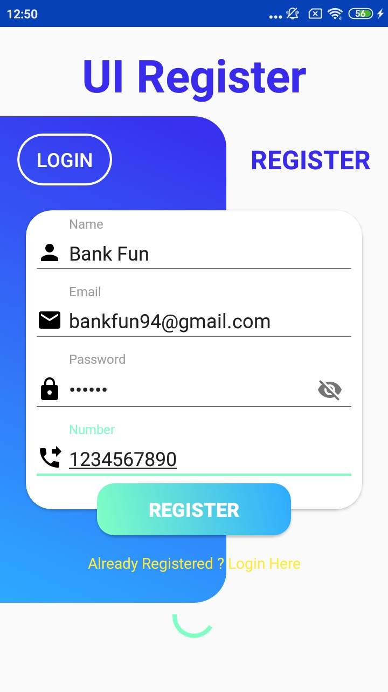
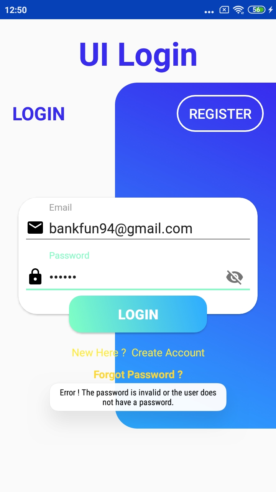
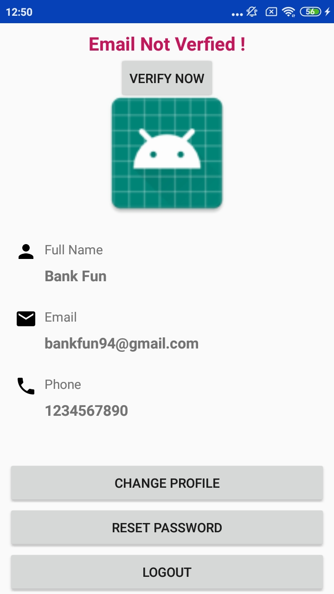

# Firebase-Email-Authentication
In this application I have implemented firebase email authentication system. where user can create new account, login using the email and password.

## Features
1. Create New account with email
2. Saved user Data with FireStore
3. Forgot Password options
4. Verify User Email

#### This android app source code is provided for the Video Tutorial Series on youtube channel (Own Coding) You can watch Full tutorial series here.

- Add yours google-services.json
- Change Authorization:key with your key from firebase project

Implementation Guide

1. Open the Project in your android studio;
2. IMPORTANT Change the Package Name. (https://stackoverflow.com/questions/16804093/android-studio-rename-package)

Not able to carry this project anymore, but anybody who wanted to work on this project can do happily.
I am attaching images with this, if you like then do try it....

### Screenshots of Apk

 Login UI                               | Registration UI                                     | Profile UI                                     |
:------------------------------------------:|:-------------------------------------------:
||  |
